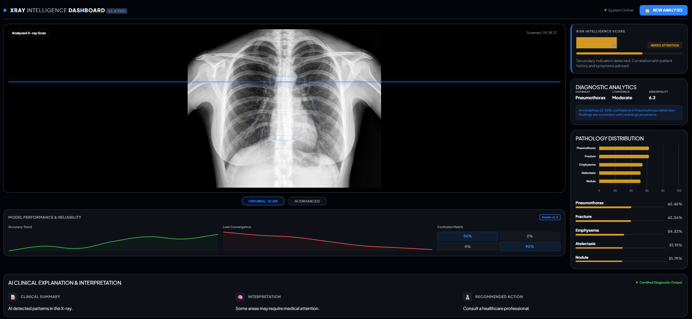

# 🧠 AI X-Ray Intelligence & Diagnostic System

A full-stack AI-powered diagnostic system for chest X-ray analysis, combining deep learning, risk assessment, and human-readable clinical insights into an interactive dashboard.

---

## 🚀 Why This Project?

Traditional X-ray analysis systems:

* Provide raw predictions without interpretation ❌
* Lack risk assessment ❌
* Are not user-friendly ❌

This system solves that by:

✔ Detecting multiple diseases from a single X-ray
✔ Classifying severity (Normal / Needs Attention / Critical)
✔ Generating AI-powered clinical explanations
✔ Visualizing results through a modern dashboard

---

## ✨ Key Features

* 🔍 **Multi-label Disease Prediction**
  Detects multiple abnormalities using a pretrained deep learning model

* ⚠️ **Risk Assessment System**
  Classifies cases into:

  * **Normal**
  * **Needs Attention**
  * **Critical**

* 📊 **Interactive Dashboard UI**
  Clean and responsive interface with:

  * Image display
  * Predictions
  * Confidence graphs
  * Risk indicators

* 🧠 **AI Clinical Explanation (Ollama)**
  Converts predictions into:

  * **Summary**
  * **Meaning**
  * **Recommendation**

* 📈 **Analytics & Visualization**

  * Prediction distribution
  * Confidence scores
  * Model performance insights

---

## 📊 Results & Analysis

### 🖥️ Dashboard Overview


---

### 🧪 Sample Prediction 1

* Moderate confidence abnormality detected
* Classified as **Needs Attention**
* AI suggests further clinical evaluation



---

### 🧪 Sample Prediction 2

* High-confidence abnormality detected
* Classified as **Critical**
* Immediate medical consultation recommended


---

## 🧠 What Makes This Different?

Unlike typical X-ray AI projects, this system:

* Combines **Computer Vision + LLM reasoning**
* Provides **actionable insights**, not just predictions
* Includes a **complete web dashboard**
* Designed as a **real-world deployable solution**

---

## 🧠 Model Details

* **Architecture:** DenseNet121
* **Framework:** PyTorch + TorchXRayVision
* **Task:** Multi-label classification
* **Input:** Chest X-ray images
* **Output:** Disease probabilities + risk classification

---

## ⚙️ How to Run

### 1. Clone the repository

```bash
git clone https://github.com/projectbin07-stack/xray-analysis-aiml.git
cd xray-analysis-aiml
```

### 2. Install dependencies

```bash
pip install -r requirements.txt
```

### 3. Run the application

```bash
python app.py
```

### 4. Open in browser

```bash
http://127.0.0.1:8001
```

---

## 🛠️ Tech Stack

* **Backend:** FastAPI
* **Frontend:** HTML, CSS, JavaScript
* **Deep Learning:** PyTorch
* **Medical Model:** TorchXRayVision
* **Image Processing:** OpenCV
* **Visualization:** Chart.js
* **AI Explanation:** Ollama (LLM)

---

## 📁 Project Structure

```
xray-analysis-aiml/
│
├── app.py
├── core/
│   └── xray_engine.py
├── templates/
│   └── index.html
├── static/
│   ├── style.css
│   └── script.js
├── assets/
│   └── images/
├── requirements.txt
└── README.md
```

---

## ⚠️ Disclaimer

This project is intended for **research and educational purposes only**.
It is **not a substitute for professional medical diagnosis**.

---

## 💡 Future Improvements

* Custom-trained models for higher accuracy
* Integration with hospital systems
* Real-time monitoring and alerts
* Mobile and cross-platform support

---

## 👨‍💻 Author

**Navaneeth KG**
Embedded Systems & AI Developer
Founder — Indionics

---

## ⭐ Support

If you found this project useful, consider giving it a ⭐ on GitHub!
