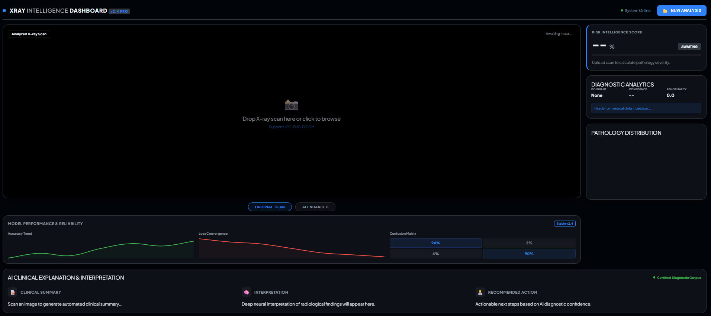

# AI-Based X-Ray Intelligence & Diagnostic System

[](https://www.python.org/)
[](https://fastapi.tiangolo.com/)
[](https://pytorch.org/)

A high-performance, product-level AI diagnostic dashboard for radiological analysis. This system leverages deep learning to provide multi-label disease prediction, risk assessment, and automated clinical interpretations of chest X-rays.

## Dashboard Overview



## Core Features

- **Multi-Label Pathology Prediction**: Simultaneous detection of multiple lung conditions using state-of-the-art neural architectures.
- **Dynamic Risk Assessment**: Real-time severity scoring (0-100%) and clinical triaging (Critical/Attention/Normal).
- **AI Clinical Explanation**: Automated medical report generation powered by Llama3 (Ollama) for summary and interpretation.
- **Interactive Analytics**: Real-time confidence distribution charts and abnormality scoring.
- **Model Reliability Tracking**: Integrated performance metrics including accuracy/loss trends and confusion matrices.
- **Radiological Enhancement**: Specialized filters for AI-enhanced viewing of radiological findings.

---

## Sample Analysis Results

| Sample 1 (Pathology Detected) | Sample 2 (Normal Baseline) |
|------------------------------|---------------------------|
|  |  |

---

## Technical Specifications

### AI Model Architecture
- **Framework**: PyTorch + TorchXRayVision
- **Core Model**: DenseNet121 Optimized for Radiological Features
- **Classification**: Multi-label classification with specialized weights
- **Dataset**: Pretrained on large-scale clinical medical datasets (ChestX-ray14)

### Technology Stack
- **Backend**: FastAPI (Python)
- **Frontend**: Modern Vanilla JS, Chart.js, Plus Jakarta Sans Typography
- **Inference Engine**: TorchXRayVision (X-Ray pathology) + Ollama (Report generation)
- **Image Processing**: OpenCV / Pillow

---

## How to Run

1. **Install Dependencies**:
   ```bash
   pip install -r requirements.txt
   ```

2. **Run Application**:
   ```bash
   python app.py
   ```

3. **Access Dashboard**:
   Open [http://127.0.0.1:8001](http://127.0.0.1:8001) in your browser.

---

## Professional Disclaimer

**Research & Educational Use Only**: This project is intended for research and educational purposes only. It is not intended for use in actual medical diagnosis or treatment. All findings should be verified by a certified healthcare professional.

---
*Developed with focus on AI transparency and high-fidelity medical UX.*
